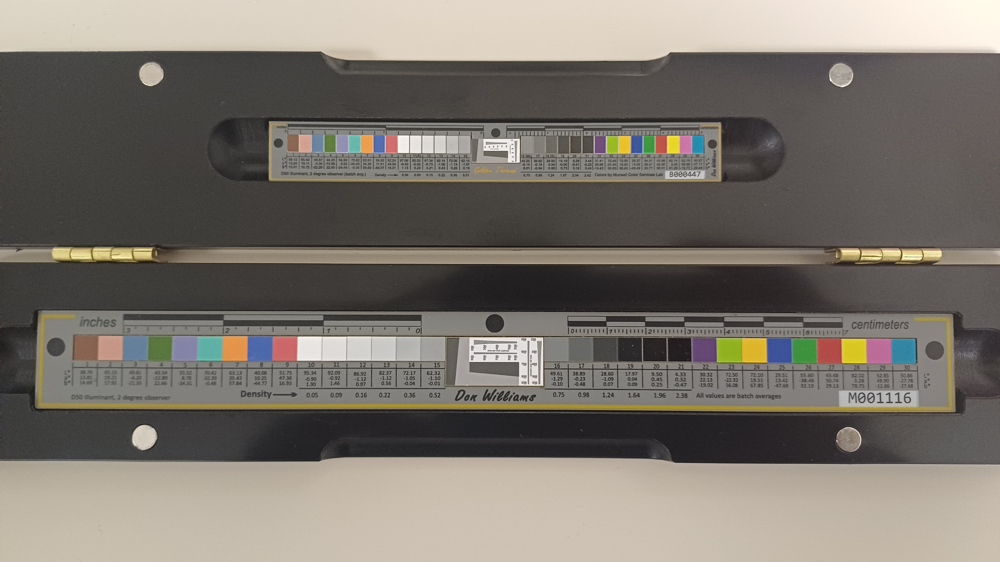
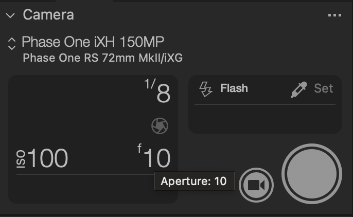
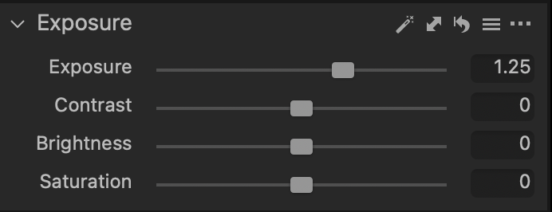
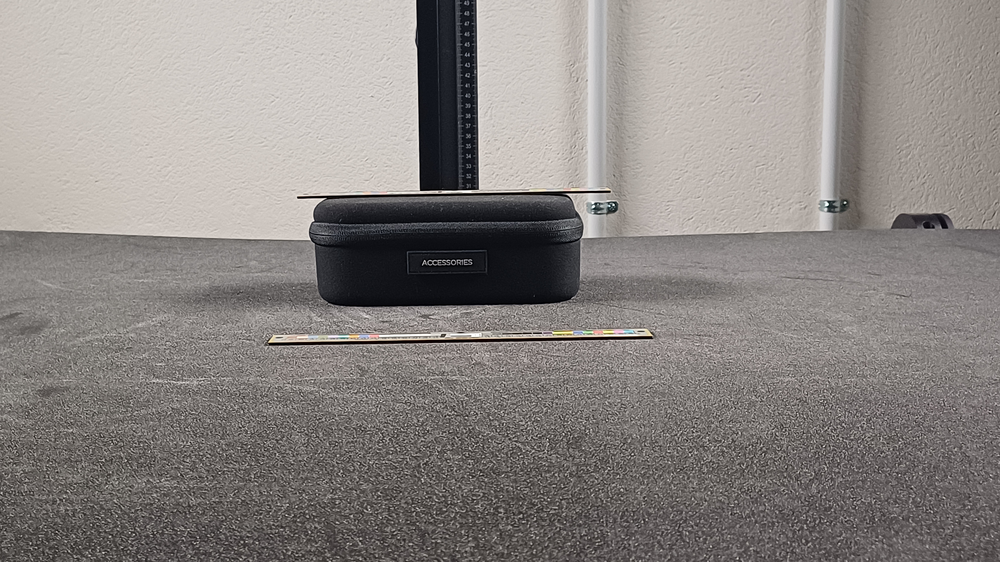
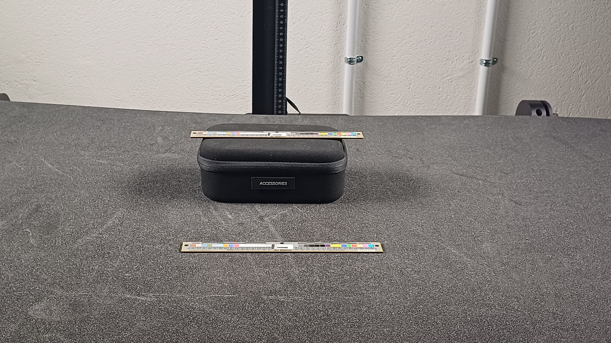
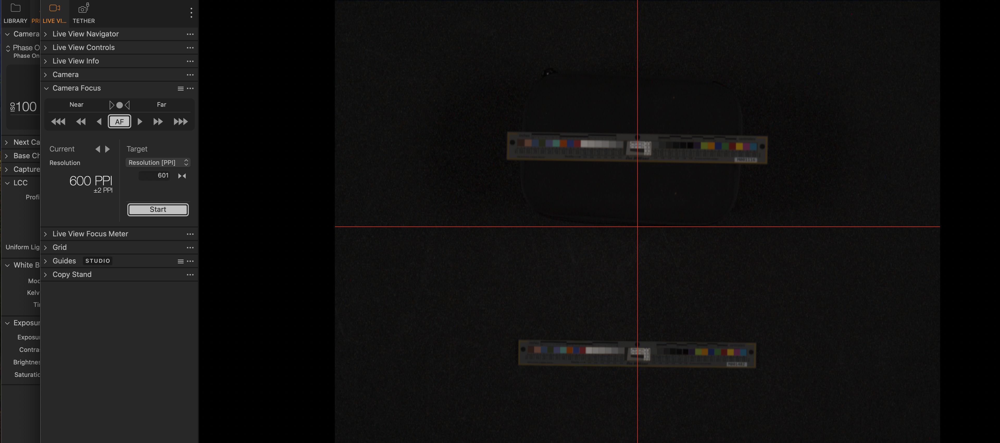
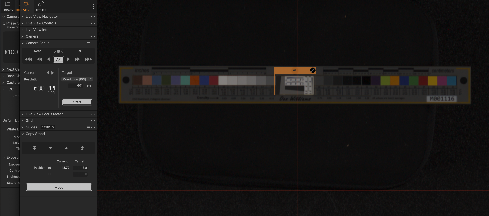
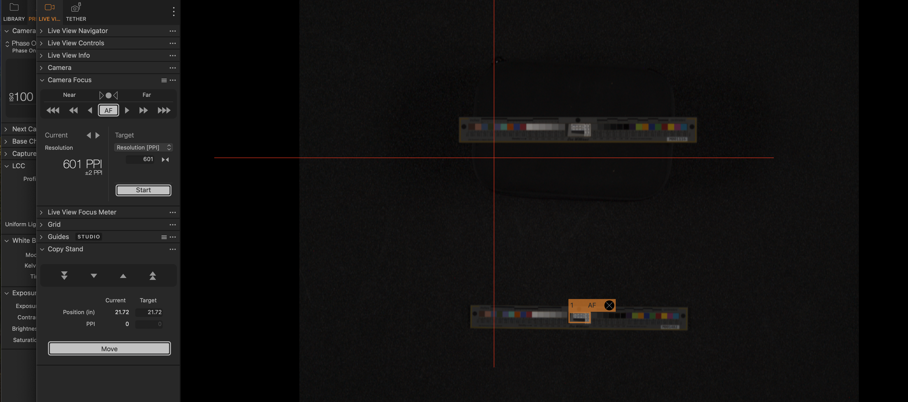
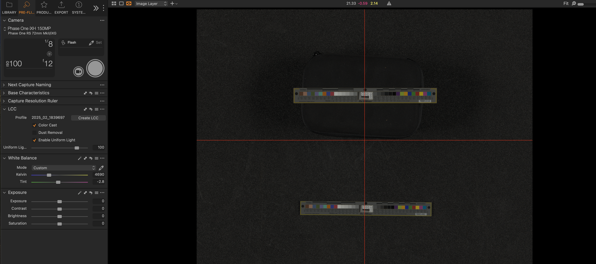
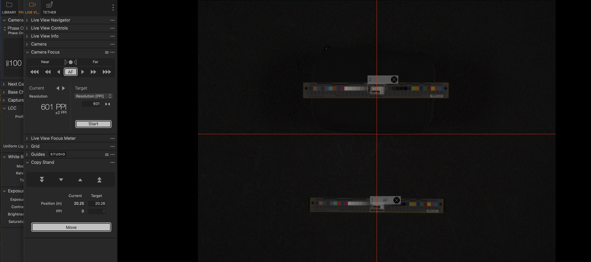

# Special Case - 3D Object Calibration & Stitching 
## Pre-Flight
For this special case we will need to calibrate the station with 2 object level targets.

Shooting with 3D objects requires us to take into consideration the depth of field of the object.
- **Depth of field** is how much of your image/object is in view from front to back.

Since we are shooting a 3D object, it requires a greater depth of field as opposed to a 2D object where we don't need to worry about a depth of field since the object is flat.

In order to achieve a greater depth of field, we need a smaller **aperture**, however making the aperture smaller affects the lighting of the image, so it would appear darker, less light is entering the camera.

To compensate for this we need to decrease the **shutter speed** and increase the **exposure**. A lower shutter speed means that the camera lens stays open longer, allowing more light to enter the camera lens. Increasing the exposure makes the camera sensor more sensitive to light which results in brightening the image. Both methods help to combat and stabilise the issue of less light entering the camera due to the lower aperture.

These two targets help to bring into focus the top and bottom of the object at the same time and here is how we do that.

We place our two targets a good distance apart. One target sits flat on the foam bed while the other target sits higher, (on an object of similar height), to the object we want to capture. This setup will help us simulate the depth of field for our object.

# Calibration
After positioning  both targets correctly, calibrate each one individually using the same procedures as you would with the larger FADGI or DICE targets on the Object Level target.

> **Important**
> - Autofocus on the first target until you achieve the desired 600 PPI
> - Record the exact distance from this target to the camera
> - Repeat these steps for the second target.

When you have both measurements for both targets you can determine the depth of field to keep your object in sharp focus. This approach lets you verify that the chosen aperture settings will provide the required depth of field to keep the object in focus, throughout the entire vertical range.

Next take both recorded distances of the two targets, add them and divide that total by two to find the mean(average) distance, height wise, between both targets. 

We use this setup because our goal is to maintain focus throughout the object we are capturing, from its highest points to the lowest points. As previously mentioned we are shooting a 3D object on a 2D plane. That means that the methods we already use have to be altered to suit 3D objects.

This method aims to find the ideal focal point, exactly halfway between the highest and lowest point. By doing this we ensure that both the top and bottom of the object stay equally sharp in our image and that they do not lose any quality while zoomed in.
- When we focus halfway between the top and bottom targets, it's like finding the middle ground where both ends of our object will be equally in focus - not super sharp, but not too blurry either

Once you have determined the optimal focal point, the average(mean) you just calculated.
Zoom out to include both targets.

Use the autofocus to achieve the 600 PPI resolution
“Calibrate” each target individually, as you would
- Colour readouts
- Cropping
- Exporting
- Submit to Qa
*For this special case, are goal is to hit 80%, wants both targets have met the threshold, proceed with stitching*

# Stitching process
See special case - stitching in versa\
Stitching 3D Object Example - West North African Musket

lighting on nexus was 10.98(11) to see how high the numbers can go, when they dont match we change the exposure to get the right numbers

# Exporting Issues
Shooting 3D objects is one thing but exporting them after photoshop is another. The .tif file format can only support images up to 4GB, depending on the size and scale of the object in question, that file size can and will exceed 4GB. To combat this issue you need to select the **BigTIFF** option on the export window. Your file will be larger, which is expected, but it will be exported in the .tif format rather than using the compromised .psb format.
