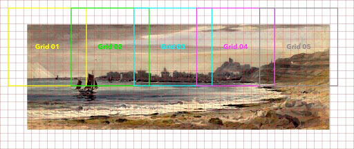
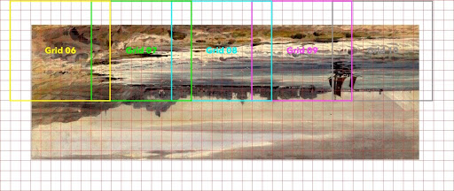

# Versa Object Stitching Workflow
## Step 1: Prepare Your Setup
1. Camera Position
    - Ensure your camera is positioned for optimal perspective.
    - For oversized objects (e.g., twice as deep as the table),  extend the camera forward to maintain focus and proper perspective.

2. Support
    - For objects that extend beyond the flatbed (e.g., large paintings), place a larger support (like black foam) under the object. This helps stabilize the object and makes rotating it easier during shooting.

## Step 2: Calibration
1. Target Calibration
    - Place a FADGI calibration target on the support.
    - This step ensures your camera settings are properly aligned for accurate stitching.
2. Remove the Target
    - After calibrating, remove the target from the setup.

## Step 3: Set Up Your Object
1. Place the Object
    - Position your object on the support, ensuring it's properly aligned and centered.
2. Refocus
    - Refocus the camera after placing the object to ensure everything remains sharp.

## Step 4: Define Overlap and Framing
1. Overlap
    - Aim for a 10-20% overlap between frames.
    - This overlap helps ensure smooth stitching later.
2. Crop Margin
    - Leave about 10% margin around the edges of the object for clean stitching. You’ll crop this out in the later stages.
3. Grid Setup
    - Set up a 20% grid in Capture One for precise alignment.
    - Use the grid to ensure consistency across frames (e.g., align key features to the gridlines).
4. Center the Object
    - Ensure the object is centered on the support and fills the frame with minimal borders around it.

## Step 5: Capture the Top Section
- This is where you begin capturing images of the top section of your object, which will later be stitched together.

## Step 6: First Frame
1. Capture the Top Section
    - Start by capturing the top section of the object.
    - Make sure your first frame is inside the 10% crop area, with the top boundary and left grid line centered in the frame.
2. Live View Settings
    - Switch to viewfinder mode in Capture One’s live view.
    - This offers a clearer image and helps with precise framing compared to simulated exposure mode.
3. Turn Off Crop
    - Disable crop settings in Capture One while adjusting the object.
    - This ensures you see the full frame and avoid any accidental cropping.

## Step 7: Move the Object
1. Object Movement
    - As you capture each frame, carefully move the object from left to right.
    - Ensure you maintain a 10-20% overlap between each shot. This overlap ensures proper alignment during stitching.
2. Maintain Straight Reference
    - Use the grid in Capture One to guide your movements.
    - Keep the object’s top edge (or another key feature) aligned with the gridlines as you move the object for consistent positioning.

## Step 8: Rotate and Capture the Bottom Section
1. Rotate the Support Board
    - After capturing the top section, rotate the entire support board 180 degrees to photograph the bottom half of the object.
    - This step helps maintain proper overlap and alignment across the whole object.
2. Focus on Overlap
    - Focus on the overlap consistency between frames (10-20%). Don’t stress too much about the number of frames, just prioritize maintaining smooth overlap for stitching.

## Step 9: Verify Overlap and Alignment
1. Check Middle Overlap
    - Once the top and bottom sections are captured, flip the images in Capture One and check the overlap in the middle section.
    - Make sure the overlap is consistent at 10-20% to ensure smooth stitching.
2. Multi-Image Viewer
    - Use Capture One’s multi-image viewer to see both the top and bottom frames side by side.
    - This will help identify any misalignment or areas where the overlap might not be sufficient.

## Step 10: Capture Remaining Frames
1. Continue Shooting
    - Keep shooting the remaining frames of the object following the same overlap principles (10-20%).
2. Lens Considerations
    - Be mindful that the outer edges of your frames might be softer due to lens projection (lenses tend to project images in a circular shape).
    - When selecting your crop area, ensure key features are within the sharpest parts of the image.

## Step 11: Apply Final Crop
1. Apply 10% Crop
    - Use a 10x10 grid in Capture One to apply a 10% crop around all your images.
    - This will help eliminate any soft edges and ensure a uniform appearance.
2. Copy Crop Settings
    - Once you’ve applied the crop to the first image, copy and paste these crop settings to the rest of your images for consistency.

## Step 12: Export Your Images
1. Export Final Images
    - After cropping, export the images for stitching.
    - You can now export them as TIFFs, JPEGs, or any format that works best for your needs.