# General Workplace Preparation
These rules are set in place and **should be followed** to prevent and reduce any further damage done to the historical objects.

**Before entering the workspace (103 suite) all Operators should**:

- not carry any liquid or food items into the workspace
- be present and on time after the morning stand up meeting
- remove any jewellery related to fingers, hands and wrists
- wash and dry their hands thoroughly
- avoid touching their face or other potential contaminant surfaces
    - if contamination is unavoidable, wash and dry hands immediately
- wear the provided safety equipment in the workspace at all times

# Hardware Preparations and Setup
Below are a series of steps each Digitisation Technician, Operator, should follow each day to prepare their workstation. Currently there are two types of workstations. The *V-bed Scanner* (*BC100*) and The *Flatbed Scanner* (*VERSA/DTVERSA*). Each scanner has different mechanical setups however they both use the same software.

## BC100 Scanner Hardware Setup
Below are a series of steps related to the BC100 Scanners within the 103 suite (from top to bottom after the main door: 103F, 103F, 1O3E, 103E). Each BC100 Scanner has two seating positions, left and right. Each one will follow the steps listed below.

[image of full station]

**Lights**  
Approach the left side of the workstation and unzip the protective tarpaulin.

<figure markdown>
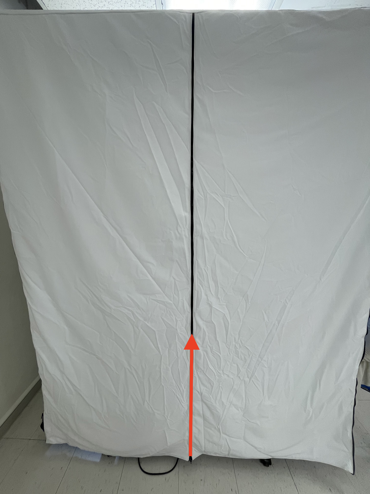{ width="500px" data-title="Workstation with zipped protective covering" data-description=".custom-desc1" data-gallery="BC 100"}
<figcaption>Workstation with zipped protective covering</figcaption>
</figure>

    

Behind the monitor on the left side of each BC1OO station, is the control panel for the lights. The power switch will be on the right most end of the panel. This is the only switch that does not have any dials below it.

<figure markdown>
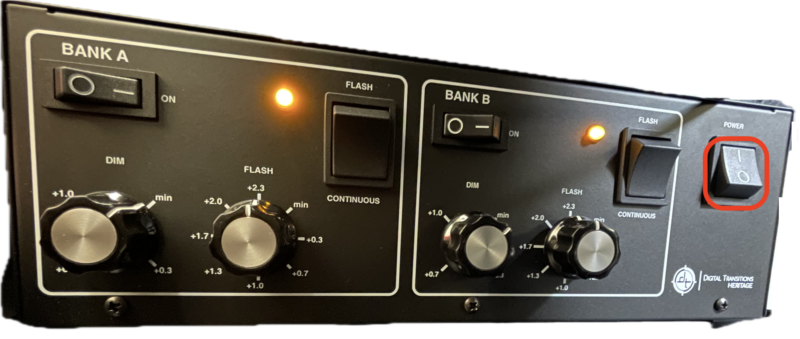{ width="1000px" data-title="Lighting Power Supply" data-description=".custom-desc2" data-gallery="BC 100"}
<figcaption>Lighting Power Supply</figcaption>
</figure>

    

From left to right, confirm for both *Bank A* and *Bank B*:

- their individual power switches are set to on
- their lighting switches are set to continuous
- the first dial from the left labelled *DIM* is set to *min*
- the second dial from the left labelled *FLASH* is set to *+2.3*

**Computers (macStudios)**   
At the back of each macStudio, there is a power button at the bottom left. If you are unsure, place your finger in the middle to land on the cables as a guide, then move as far left as you can. Your finger should feel a faint imprint, that is the power button. You will know when you see a white light appear at the front on the bottom right. 

<figure markdown>
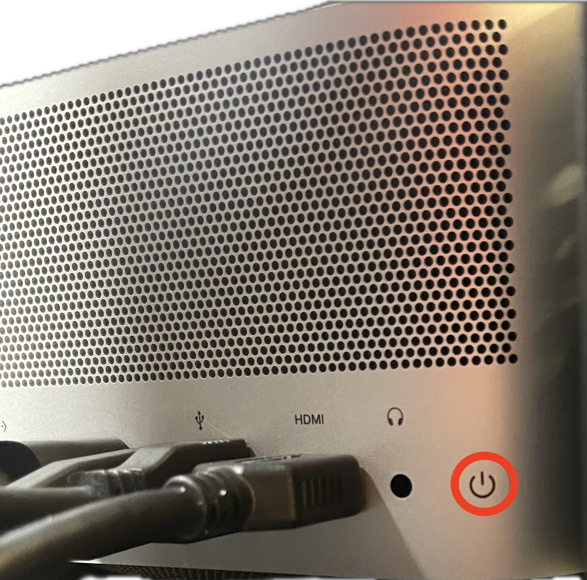{ width="500px" data-title="Workstation Computer's Power Button" data-description=".custom-desc3" data-gallery="BC 100"}
<figcaption>Workstation Computer's Power Button</figcaption>
</figure>

    

A white light should appear at the front, in the bottom right, to signal the station is powered on.

<figure markdown>
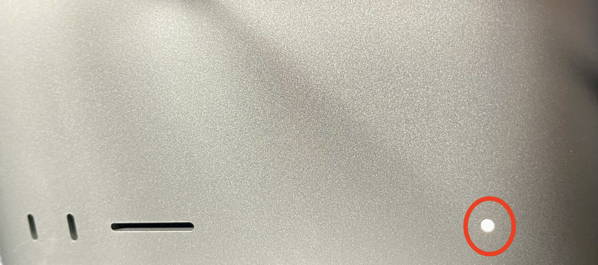{ width="500px" data-title="Workstation Power Indicator" data-description=".custom-desc3-5" data-gallery="BC 100"}
<figcaption>Workstation Power Indicator</figcaption>
</figure>

    

??? note "Still not sure?"
    *If your finger feels a hole, it is the headphone jack, and you should move one over*

**Cameras** - rewrite (we do not do this anymore)

- Prepare the cameras by plugging in the relevant loose cables into the ports at the back of the cameras, ensuring the red dots on the cables align with the red dots on the camera ports.
- Unscrew and remove the lens caps carefully, without harming the lenses underneath.

<figure markdown>
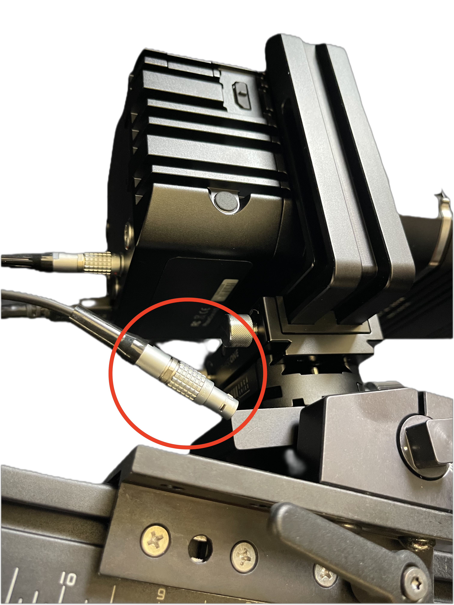{ width="300px" data-title="Unplugged Power Cable" data-description=".custom-desc4" data-gallery="BC 100"}
<figcaption>Unplugged Power Cable</figcaption>
</figure>

    

<figure markdown>
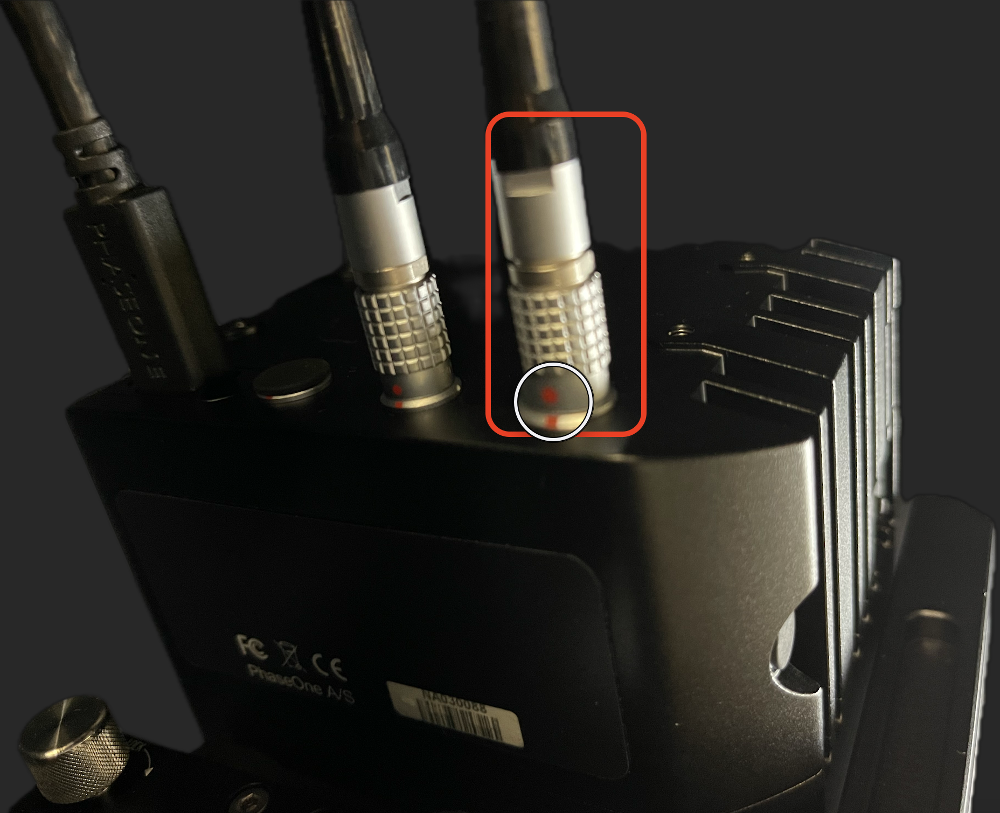{ width="300px" data-title="Connected Power Cable" data-description=".custom-desc5" data-gallery="BC 100"}
<figcaption>Connected Power Cable</figcaption>
</figure>

    

**Monitors** - remove?

- Ensure the power cable is plugged into the back of the monitor.
- Turn on the monitor by using the switch located at the bottom of the cable.

<figure markdown>
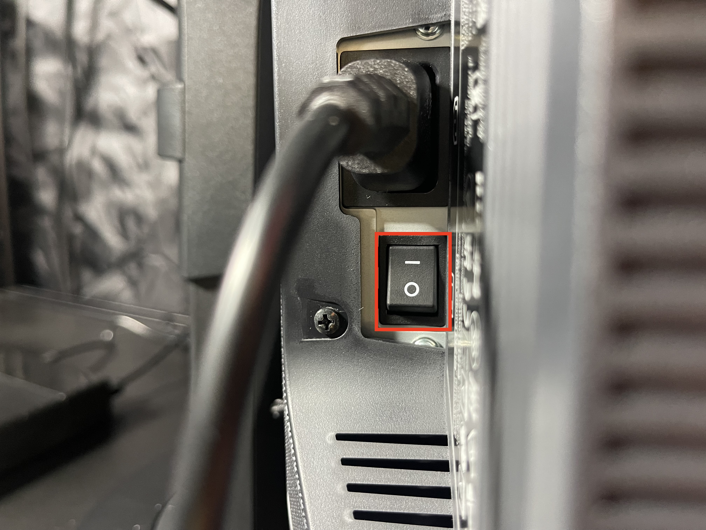{ width="300px" data-title="Monitor Power Cable" data-description=".custom-desc6" data-gallery="BC 100"}
<figcaption>Monitor Power Cable</figcaption>
</figure>

    

## Flatebed Scanner Hardware Setup
The Flatbed, VERSA/DTVERSA, Scanner follows a different hardware setup path that the BC100. Here the VERSA station only consists of a single overhead camera. 103D

### Light Settings
1. **Turn on LED Light**:
    * For scanning translucent materials (like film negatives), use the small LED light.
    * Place the light above the bench and underneath the document cradle.
2. **Turn off Overhead Lights**: Turn off the overhead fluorescent lights to avoid glare and ensure consistent lighting.

### Camera Lens Attachment
1. **Verify Lens**: Check if the current lens on the camera is the 120mm macro lens, if not ask for assisstance to change the lens
2. **Change Lens** (if necessary):
    * Unclip the silver latches from the front and back of the lens.
    * Gently pull off the incorrect lens.
    * Attach the correct **120mm** macro lens to the camera body.
    * Push the lens until it clicks into place.
    * Close and secure the silver latches.

### Camera Settings
1. **Connect Lemo Cord**: Plug the silver lens cord with the **red dot** into the back of the camera.

# Software Preparations and Setup
## Login and Startup
Now that the Station is powered on and we can begin our software setup. Enter the login credentials provided for you and launch the Capture One application. 

![image of location of capture on the desktop]

After Capture One has opened you will see a new window pop up. From here, we look for and click the `New Session...` button to get to Capture One's main window.

<figure markdown>
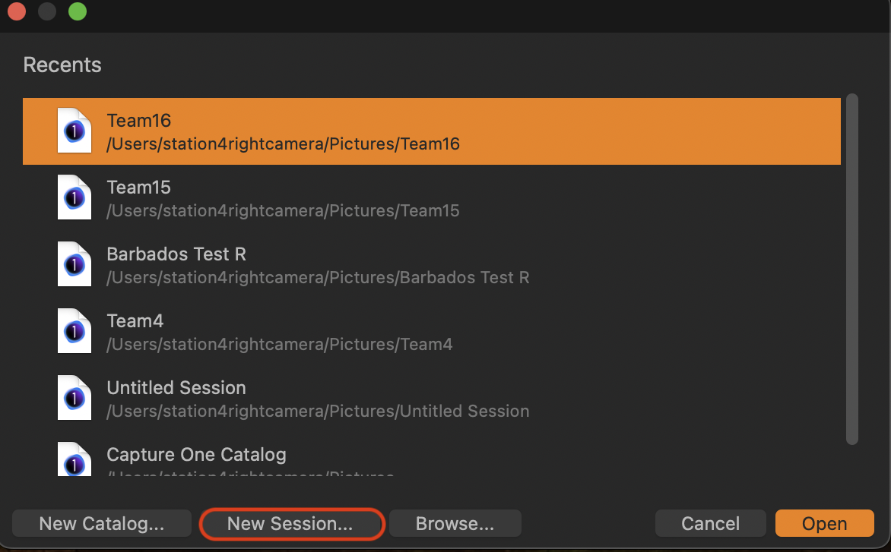{ width="586px" data-title="New Session in Open Capture" data-description=".custom-desc7" data-gallery="BC 100"}
<figcaption>New Session in Open Capture</figcaption>
</figure>

    

Now we are on the main Capture One window. As you can see, they are a myriad of tools at your disposal. Stay calm and follow the instructions provided. 

??? note "On the safe side"
    For a quick systems check, click on the `Capture` button in the top left. *It is denoted as a large Circle*. An image of the Scanner's bed will appear in the right palette.
    <figure markdown>
    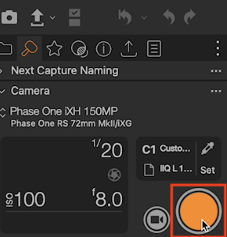{ data-title="Capture Button" data-description=".custom-desc2" data-gallery="Flatbed"}
    <figcaption>Capture Button</figcaption>
    </figure>
    

    

    

    [!image showing the result]

## System Check
Next we want to verify our *Base Characteristics*, *Sharpening* and *Noise Reduction*. 

The Base Characteristics are pre-configured settings for optimal capture quality. while further details can be found in the *[link]Pre-Flight* section.  
Ensure the following settings are set to:

- **`Mode`:** Photography
- **`ICC Profile`:** Phase One iXH 150 MP Flat Art LED `DTPortion`
- **`Curve`:** Linear Scientific

<figure markdown>
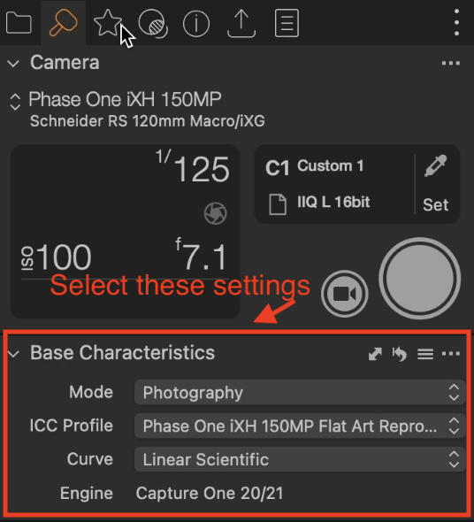{ data-title="Base Characteristics" data-description=".custom-desc3" data-gallery="Flatbed"}
<figcaption>Capture Button</figcaption>
</figure>

!!!Note
    - Under normal circumstances, you will not need to manually insert these values.
    - In the extreme left you will find the sections where the values will be edited. The large white circle is the main method capturing images and must be clicked to alter any settings.

**Sharpening**: Set the sharpening settings to:

- Sharpening: 90
- Radius: 0.8

**Noise Reduction**: Set the noise reduction settings to:

- Details: 50
- Colour: 40

<figure markdown>
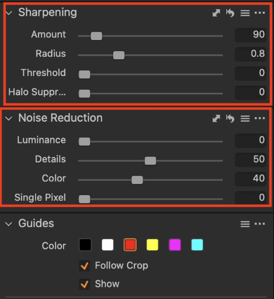{ data-title="Sharpening & Noise Reduction" data-description=".custom-desc4" data-gallery="Flatbed"}
<figcaption>Sharpening & Noise Reduction</figcaption>
</figure>

# Final Checks
**Retrieving Materials:** Locate the Porter (or the appropriate personnel) for assistance in retrieving the materials you'll be digitizing.
- Clarify with the Porter/Material Retrievers for instructions on retrieving and placing materials onto the scanner bed.

**Material Placement:** Place the materials you'll be working with in the designated cradle.

## Additional Notes
- Consult with the Digitization Team Lead for any questions or if you encounter any difficulties during the setup process. Don't hesitate to ask a more experienced team member for assistance.

- This document serves as a general guideline. Specific adjustments might be required depending on the type of material being scanned.

