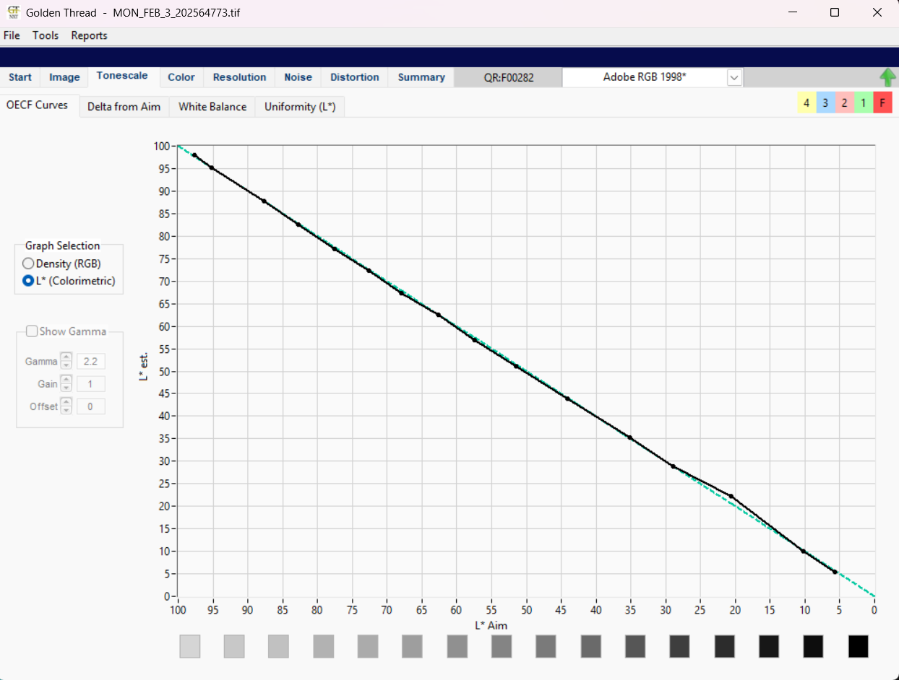
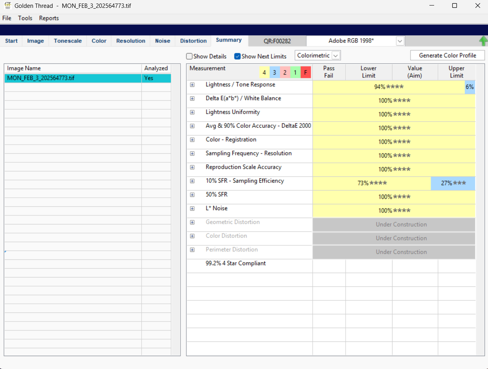
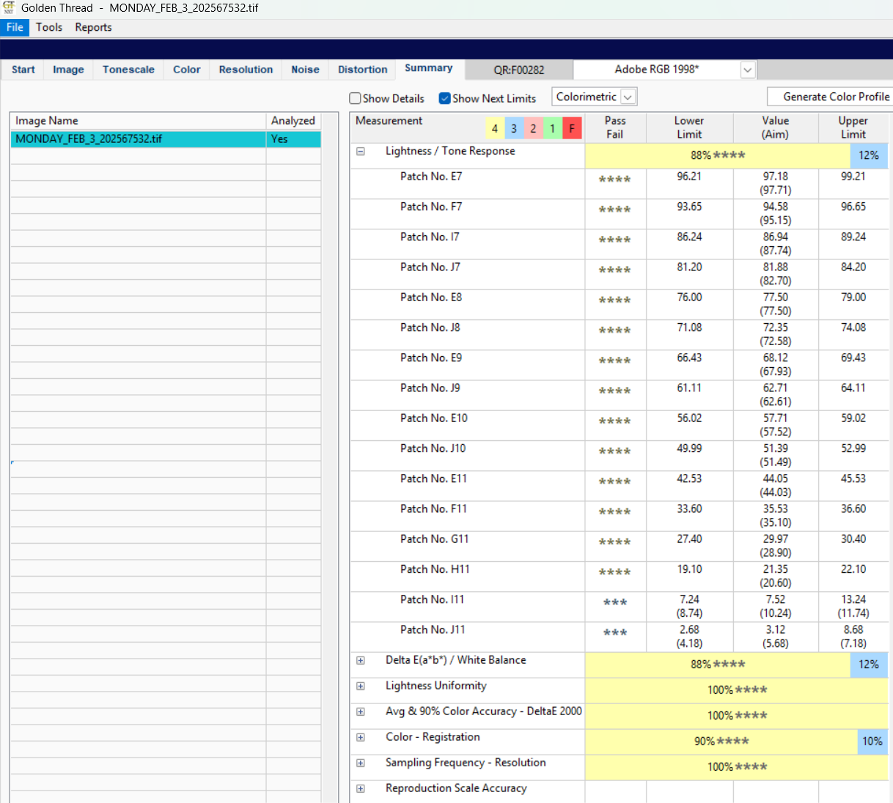

# Step-by-Step Guide: Editing Lightness and Tone 
**Lightness and Tone** are terms that relate to the brightness, contrast, and overall appearance of an image, and they are often adjusted to achieve a more balanced or visually pleasing result.
This process is primarily evaluated based on the neutral patches, ranging from white to black. When calibrating from scratch, we will have to adjust these tones. The aim is to reach four golden thread stars on all these patches. `The aim is to reach a 4 star on golden thread on all these patches`

We can get a four star score (or close to one) across the board by adjusting the following mechanical variables:

1. Exposure
adjusts the overall brightness of an image, making it lighter or darker

2. Shutter speed
controls how long the camera's shutter is open, affecting motion and light exposure

3. Aperture
controls the size of the lens opening, affecting how much light enters and the depth of field (how much of the image is in focus) (must stay at 8.0)

4. Lighting bank rig (this is especially important with the new Nexus/Gemini rigs)
setups of lights used to control the intensity, direction, and quality of light

A near perfect score based on changing mechanical settings only would look like this:

The near perfect score shows the patches that scored 4 stars on Golden Thread as well as the darker patches

The 6% means that some neutral patches were not 4 star compliant. 

## WHAT IF MY IMAGE IS ALL TOO DARK OR BRIGHT?

[iamge3] missing

WAY TOO BRIGHT  

[iamge4] missing

WAY TOO DARK

If your images are too dark or too bright in Capture One, you can adjust the Exposure, Shutter Speed and Aperture settings to correct the brightness as well as the Lighting rig:

### Adjusting Exposure in Capture One
In Capture One, the primary way to adjust exposure is by using the exposure slider in the exposure tool tab. Ensure that before you start your calibration that your exposure is set to 0. Increasing the exposure will brighten the image and decreasing the exposure will darken the image. If the image is too dark, you can drag the exposure slider to the right until the image is bright enough. If you want to preserve some tonal details, avoid pushing it too far (pass 0.3). If the image is too bright, lower the exposure slider to reduce the overall brightness of the image. This controls the amount of light captured during the shot, so reducing it will tone down the exposure without affecting other aspects of the image. However when adjusting the exposure ensure that it doesn’t fall into a negative range (e.g -1.31) (**we do not calibrate in negatives**)

### Adjusting shutter speed in Capture One 
While in calibration after the LCC step ensure that you adjust the shutter speed back either **1/8** or **1/6** seconds. A high shutter speed results in an image being too dark ( e.g 1/20). However, to fix an image that's too bright in Capture One using shutter speed, simply increase the shutter speed (e.g from ⅛ to 1/13)  in your camera settings before re-taking the shot. A faster shutter speed (shorter exposure time) allows less light to hit the sensor, reducing overexposure.

### Adjust Aperture in Capture One 
If your image is too dark or too bright, ensure that the aperture is locked at f/8.0 as this is the set aperture setting that is used for our type of imaging. ( Revisit the system's Preflight section under 'Camera Settings' and verify the configuration.) 

### Adjust Lighting Rig 
Always ensure that the light rigs are on **“continuous”** for BC- 100 by toggling the control on the lighting power supply and that both LED lights are on. For Versa ensure that the Nexus software is open and the Stella Gemini lights are set to **“Computer Control”** by going to the back of the light and toggling the switch to the correct setting.

[image5] missing

BC-100 Lighting Rig

[image6] missing

Versa Lighting Rig 

## WHAT IF MY SCORES ARE MOSTLY GOOD AND A FEW ARE OFF?
If your scores are mostly good, but there are a few issues, especially at the darker end of the neutrals, you can fix them by tweaking the luma curve a bit towards the lower end. We'll know which patches to adjust since Golden Thread shows a dropdown for each patch, along with its desired value.

The Image above shows that Patch I11 and J11 was too dark and did not hit the 4 star compliant Therefore we would need to adjust the **Luma curve**.

The Image below shows that Patch I11 and J11 was too dark and did not hit the 4 star compliant Therefore we would need to adjust the **Luma curve**.

See figures below

The patch readouts should read values of  
I11:lower limit 8.74 to upper limit 11.74 with an aim of (10.24)  
J11:lower limit 4.18 to upper limit 7.18 with an aim of (5.68)

### WHAT IS THE LUMA CURVE?
The luma curve allows you to adjust the brightness (luminance) of specific tonal ranges in your image. 
The example below shows the luma curve before any adjustments were made on the FADGI target. 

The example below shows a bad luma curve affecting patch I11 and J11 based on the generated Golden Thread values shown from the photo above.

[image]

#### Adjusting the luma curve 
When the last patch is moved **UP** on the curve, it carries **up** the value of patches H11, I11 and carries down the value of J11. When the patch is moved **DOWN** on the curve , the value of patches H11 and I11 drops and the values of J11 goes **up**.

[image]

When the Second last patch on the curve is moved **UP** it carries **up** the value of all three patches, when it is carried **DOWN** it carries down the value of all three patches.

[image]

When the middle patch is moved **UP** on the curve, it carries **up** the value of patches H11, I11 and carries **down** the value of J11. When the patch is moved **DOWN** on the curve the value of patches H11 and I11 drops and the values of J11 goes **up**

[image]

When the fourth patch on the curve is carried **UP** patch H11 **drops** and the values of I11 and J11 goes **up**. When it is carried **DOWN** the values of patch H11 goes up and the values of I11 and J11 goes **down**.

[image]

**_Note: To determine which patches on the curve you will move and adjust will be  based on the readout values. These values give the feedback needed to change the patches' positions, helping the curve stay in line with the data._**

After correcting the curve and sending the image to be tested in Golden Thread you should attain almost the perfect score. 

## The Perfect Score 

[image]

### The Perfect Luma Curve
After you adjusted the curve you should get almost the perfect score 
The patch readouts should read values of

H11:lower limit 17.98 to upper limit 20.98 with an aim of (**19.48**)\
I11:lower limit 8.46 to upper limit 11.46 with an aim of (**9.96**)  
J11:lower limit 2.91 to upper limit 5.91 with an aim of (**4.41**)\
( Congratulations you hit a 4 star compliant based on the values given in the Golden Thread assessment. )

[image]

Values of full 4 star compliant

## WHAT IF I ADJUST MY LUMA CURVE TOO MUCH?
Excessive bumps, lifts, or dips in the luma curve suggest underlying issues and the curve should be kept as straight as possible for optimal results. Any humps should be corrected before relying on curve adjustments. (This requires patience and a steady hand)

[image]

# Step-by-Step Guide: Creating an LCC Profile in Capture One
## What is LCC?
The **Lens Cast Correction (LCC)** ensures neutrality and color accuracy by providing even exposure and brightness across the frame, avoiding ‘light falloff.’ Light falloff refers to the gradual decrease in brightness from the center of the image towards the edges and corners.
### How to Create an LCC Profile
#### 1. Capture an LCC Reference Image
- Place a white board in front of the lens to cover the entire field of view.

[iamge]

The image above shows how to position your white board. 

By opening Capture One Live View you can reference if your board covers the entire field and it is shown perfectly below:

[image]

- Adjust the **Shutter Speed** to a value between **1/8** and **1/20** before capturing the image.

- Add Color **Readouts** in the **middle**, **upper**, **and lower edges** of the frame.
In this case, Shutter speed of 1/15 was used and Readouts placed at 5 different positions. Using the red guide to place the middle readout to get an accurate value.

[image]

- Ensure the **Color Readout values fall within the 65-70 range** before creating the LCC.

[image]

After capturing again at 1/20 the readout values are good enough to go ahead and create the LCC Profile.

#### 2. Import the LCC Image into Capture One
- Open **Capture One** and create a **new session** or open an existing one.
- Import your LCC reference image by clicking **File > Import Images**, then navigate to your LCC shot and click **Open**.

#### 3. Apply the LCC Profile
- Select the LCC reference image in the ***Browser** panel.
- Open the **LCC Tool** by navigating to **Lens > LCC** in the toolbar.
- Click **Create LCC Profile** to analyze and generate the LCC correction.
- Ensure the options for **Dust Removal, Color Cast, and Light Falloff Correction** are checked.
- Click **Apply** to save the LCC profile.

[iamge]

After the LCC is created and the values are good, always change back to 1/8 shutter speed and capture the target and proceed to exposure and dropping color readouts on the patches. **You made it this far, Well Done!**

[image]

#### 4. Apply the LCC Profile to Your Images
- Select all images shot under the same conditions as the LCC reference image.
- Click the **Copy & Apply** button in the **LCC Tool**.
- Check the LCC profile in the **Adjustments Clipboard**, then click **Apply**.

#### 5. Verify and Adjust (If Needed)
- Zoom into your images and check for any unwanted color shifts or artifacts.
- If necessary, tweak the **Light Falloff** or **Color Cast** settings in the **LCC Tool**.

### What If My Lightness Uniformity is Off in Golden Thread?
If Lightness Uniformity is off, this indicates an issue in key LCC creation. Here’s what you can do:

[image]

The image above shows a Golden thread score of Lightness Uniformity being off

#### Troubleshooting Steps:
##### 1. Check the White Board
- If the board is **damaged, creased, or dirty**, it can affect the color reading.
- Replace it with a **clean, flat white board**.

##### 2. Ensure Proper Positioning
- The white board must be held **parallel to the glass** to avoid uneven brightness.
- It should cover the **entire field of view** to prevent inaccurate color readings.

`Perfect examples of positioning the white board correctly and incorrectly:`

[iamge]

[image]

[image]

##### 3. Adjust Shutter Speed
- If the LCC is created out of range:
    - If the image is **too dark**, reduce the shutter speed between **1/13** and **1/15**.
    - If the image is **too bright**, increase the shutter speed between **1/20** and **1/25**.
- **Recapture** the image after adjustments.

### Tips for Best Results
- Always shoot an LCC reference image whenever you change **lenses, apertures, or camera setups**.
- Keep the **white panel clean** to avoid introducing dust artifacts.
- **Store** your LCC profiles for future use when shooting in similar conditions.

By following these steps, you’ll ensure cleaner and more color-accurate images in Capture One. **Happy editing!**

# Step-by-Step Guide: Editing SFR 10% AND 50%

## What is the SFR? 
A numerical value that describes how a camera changes contrast as a function of spatial frequency response. It's a measure of how well a camera's lens and sensor can resolve details in an image. In golden thread there are 2 types of SFR measurements.

[image]

### 50% SFR 
In Golden Thread the 50% SFR provides guidance on whether adjustments should be made to either increase or decrease the radius levels in the sharpening tab. This determination is based on the results of the corresponding graph below.

[image]

This image depicts what we aim our SFR graph to look like. If what is on your golden thread graph is similar to this you are on the correct track, however if not follow these troubleshooting steps below.

#### Troubleshooting 50%SFR
After completing the calibration within the Golden Thread, in the event the 50% SFR is off by approximately 60% with a 3 star complaint it becomes necessary to analyze and adjust the position curves on the SFR graph and bring it within an acceptable range. The key objective is to refine the settings and correct the difference to align with golden thread.  

On the SFR graph there are 3 distinct colored markers on the x and y axis and the position of your curves within these markers determines a star compliant level. 
- Between the Red markers indicates a 2 star compliant level 
- Between the Blue markers indicates a 3 star compliant level 
- Between the Yellow markers indicates a 4 star compliment level 

[image]

Our aim is to place our curves on the golden thread graph between the yellow markers. This is done by increasing or decreasing the radius so that our curves are positioned between the yellow color markers on the graph. As you can see in the image above the curves are not passing through our yellow markers on the graph, therefore we have not achieved a 4 star compliant level.

##### How to increase or decrease your radius?
The radius is found in the system's check heading under the sharpening tab. See image below. 

[image]

Select one of the values ranging 0.3 - 0.5 (preferably moving up or down by the value 0.1) depending on your system and this should rectify your 50% SFR issues.

##### How do you know if you have to increase or decrease your Radius?
If your curves are positioned more to the **left** on the outside of your yellow colored vertical lines you should **increase** your radius preferably to a maximum of 0.5. 

[iamge]

In the image above our curves are located more to the **left** of our yellow markers, therefore we need to **increase** our radius.
 
If your curves are positioned more to the **right** on the outside of your yellow colored vertical lines you should **decrease** your radius preferably to a minimum of 0.3.

[image]

The image above shows our curves located more to the **right** of our yellow markers therefore we have to **decrease** our radius. 

If you have correctly followed the troubleshooting steps you should have a SFR graph resembling the image below. 

[image]

### 10% SFR - Sampling Efficiency 
Is a metric used in digital imaging to assess how well a camera captures fine details, specifically by measuring the spatial frequency. Essentially, it indicates how much of the potential detail in an image a camera can actually capture at a given resolution, with a higher percentage signifying better detail capturing ability.

#### Troubleshooting 10% SFR - Sampling Efficiency
When undergoing the process of calibration the numerical values in your Noise reduction tab should be as follows:
- Details - 50 
- Color - 40
- Single Pixel - 0 

[image]

These are the settings that are used to produce the best possible score within the golden thread, however you may notice that the luminance is missing. In the event that you encounter an issue in golden thread where the 10% SFR is producing a 3 star or lower compliant level, you proceed to undergo the following process found below to rectify your issue: 

[image]

The image above shows an example of a 10% SFR - Sampling Efficiency that needs adjusting. 
To rectify this issue you follow the process below.
- Change the luminance numerical value of the Luminance found in the Noise Reduction Tab. The most reliable values to use are 0, 40 or 50. It is important to note every time you make a change in the systems check tab you **MUST** capture again after all changes are made. 

[image]

After you have changed your value and captured your image, run your image through a Golden Thread and your issue should be resolved.

# Versa Object Stitching Workflow - Breakdown
## Step 1: Prepare Your Setup
1. Camera Position
    - Ensure your camera is positioned for optimal perspective.
    - For oversized objects (e.g., twice as deep as the table), extend the camera forward to maintain focus and proper perspective.
2. Support
For objects that extend beyond the flatbed (e.g., large paintings), place a larger support (like black foam) under the object. This helps stabilize the object and makes rotating it easier during shooting.

## Step 2: Calibration
1. Target Calibration
    - Place a FADGI calibration target on the support.
    - This step ensures your camera settings are properly aligned for accurate stitching.
2. Remove the Target
    - After calibrating, remove the target from the setup.

## Step 3: Set Up Your Object
1. Place the Object
    - Position your object on the support, ensuring it's properly aligned and centered.
2. Refocus
    - Refocus the camera after placing the object to ensure everything remains sharp.

## Step 4: Define Overlap and Framing
1. Overlap
    - Aim for a 10-20% overlap between frames.
    - This overlap helps ensure smooth stitching later.
2. Crop Margin
    - Leave about 10% margin around the edges of the object for clean stitching. You’ll crop this out in the later stages.
3. Grid Setup
    - Set up a 20% grid in Capture One for precise alignment.
    - Use the grid to ensure consistency across frames (e.g., align key features to the gridlines).
4. Center the Object
    - Ensure the object is centered on the support and fills the frame with minimal borders around it.

[image-ted]

## Step 5: Capture the Top Section
- This is where you begin capturing images of the top section of your object, which will later be stitched together.

## Step 6: First Frame
1. Capture the Top Section
    - Start by capturing the top section of the object.
    - Make sure your first frame is inside the 10% crop area, with the top boundary and left grid line centered in the frame.
2. Live View Settings
    - Switch to viewfinder mode in Capture One’s live view.
    - This offers a clearer image and helps with precise framing compared to simulated exposure mode.
3. Turn Off Crop
    - Disable crop settings in Capture One while adjusting the object.
    - This ensures you see the full frame and avoid any accidental cropping.

## Step 7: Move the Object
1. Object Movement
    - As you capture each frame, carefully move the object from left to right.
    - Ensure you maintain a 10-20% overlap between each shot. This overlap ensures proper alignment during stitching.
2. Maintain Straight Reference
    - Use the grid in Capture One to guide your movements.
    - Keep the object’s top edge (or another key feature) aligned with the gridlines as you move the object for consistent positioning.

## Step 8: Rotate and Capture the Bottom Section
1. Rotate the Support Board
    - After capturing the top section, rotate the entire support board 180 degrees to photograph the bottom half of the object.
    - This step helps maintain proper overlap and alignment across the whole object.
2. Focus on Overlap
    - Focus on the overlap consistency between frames (10-20%). Don’t stress too much about the number of frames, just prioritize maintaining smooth overlap for stitching.

[image-ted]

## Step 9: Verify Overlap and Alignment
1. Check Middle Overlap
    - Once the top and bottom sections are captured, flip the images in Capture One and check the overlap in the middle section.
    - Make sure the overlap is consistent at 10-20% to ensure smooth stitching.
2. Multi-Image Viewer
    - Use Capture One’s multi-image viewer to see both the top and bottom frames side by side.
    - This will help identify any misalignment or areas where the overlap might not be sufficient.

## Step 10: Capture Remaining Frames
1. Continue Shooting
    - Keep shooting the remaining frames of the object following the same overlap principles (10-20%).
2. Lens Considerations
    - Be mindful that the outer edges of your frames might be softer due to lens projection (lenses tend to project images in a circular shape).
    - When selecting your crop area, ensure key features are within the sharpest parts of the image.

## Step 11: Apply Final Crop
1. Apply 10% Crop
    - Use a 10x10 grid in Capture One to apply a 10% crop around all your images.
    - This will help eliminate any soft edges and ensure a uniform appearance.
2. Copy Crop Settings
    - Once you’ve applied the crop to the first image, copy and paste these crop settings to the rest of your images for consistency.

## Step 12: Export Your Images
1. Export Final Images
    - After cropping, export the images for stitching.
    - You can now export them as TIFFs, JPEGs, or any format that works best for your needs.

# Stitching On VERSA - Breakdown
## 1. Calibrating the System
- Calibration Overview:
    - Calibrate Once Per Session:\
    Calibrate once at the beginning of each session. If you have to break up an object over multiple sessions, calibrate again at the start of each new session.
- Positioning for Calibration:
    - Support Material:\
    Place supporting material (like foam or board) against the hinge on the Versa bed to achieve a perpendicular(square) relationship between the object and the camera.
    - Camera Adjustment:\
    Move the camera forward to adjust for the distance from the bed to the object.
- Cropping:
    - Crop to the Metal Plate:\
    When calibrating, ensure you crop the image so it only includes the metal plate of the target for accurate calibration.
- Camera Settings:
    - Live View:\
    Switch from simulator to live view in the camera’s live view settings to avoid glare from the screen. This gives you a better view of the object.
- Object Positioning:
    - Use Capture One's guides to position the object parallel to the back of the flatbed.

## 2. Capturing the Object
- Set Focus:
    - New Focus Point:\
    Set a new focus point that adjusts for the height of the object. This will differ from the focus point used during calibration, which is typically the center of the grid, not the object itself.
- Determine Number of Images:
    - Calculate Overlap:\
    Estimate how many images you’ll need to capture the entire object, ensuring a 20% overlap between each shot.
    - Divide the Object:\
    Divide the object into segments based on the number of images you need to take. 
- Capture Process:
    - Start at the Top Left:\
    Begin capturing from the top left corner and move towards the far right.
    - Rotate Object:\
    After capturing the top section, rotate the object 180° by rotating the support board, and start capturing the bottom section.
    - Buffer Zones:\
    Leave a 10% buffer at the top and left edges of your images during the capture to ensure clean stitching later.
- Refocus After Each Adjustment:
    - After Calibration & Repositioning:\
    Refocus the object each time after you adjust it. Keep the focus centered on the grid for consistency.

## 3. Stitching the Images
- Resolution & Settings:
    - Shoot at 600 PPI:\
    This is the recommended resolution for high-quality imaging. Ensure that your camera is calibrated at this resolution.
    - Re-calibrate as Needed:\
    If environmental factors change (lighting, temperature), recalibrate to maintain image consistency.
- Refocus After Positioning:/
Always refocus after moving or adjusting the object.
- Overlap for Stitching:/
    - Maintain a 10-20% overlap between frames. This is essential for smooth stitching in Photoshop.
- Align with Grid:/
Use Capture One’s 10% grid for precision. This ensures consistent positioning when moving the object or support.
- Final Shots & Alignment:
    - For consistency, leave 10% margin around the edges of your frames. This will be cropped later in post-processing.
    - Optional: Rotate Camera for Tighter Overlap:\
    If needed, you can rotate the camera 90° to capture the object’s top and bottom with a tighter overlay.

## 4. Exporting
- Export Settings:
    - Export in 8-bit:\
    Ensure consistency in the final output by exporting in 8-bit. This helps with smoother colour transitions.
    - Check Alignment:\
    Before exporting, ensure that all images are properly aligned (margins, grids) and that resolution remains intact.

## 5. Stitching in Adobe Photoshop
- Photomerge Tool:
    - Open the Photomerge Tool:\
    In Photoshop, go to File > Automate > Photomerge.
    - Select Your Images:\
    Browse for all the images you’ve captured and select them for stitching.
    - Choose the Layout:\
    Select Auto for Photoshop to automatically align and stitch the images.
- Post-Stitching Checks:
    - Light/Color Shifts:\
    After stitching, check for any light or color shifts between frames and adjust accordingly.

## 6. Lighting and Quality Control
- Lighting Consistency:
    -  Monitor Light Changes:\
    Lighting may shift as you move the object around the Versa bed. Be sure to keep an eye on lighting consistency while capturing.
    - Use Uniform Light:\
    Enable uniform light to reduce the risk of shadows or lighting inconsistencies that could affect the stitching quality.
- Focus on Colour Cast:
    - Regularly check for any colour casts that may develop due to lighting or camera settings. Ensuring consistent lighting throughout will minimize these issues.

## Key Points To NOTE!:
1. Calibration is done once per session unless you have a break in between sessions.
2. Ensure 20% overlap between images for proper stitching.
3. Use Capture One’s 10% grid and refocus after every move for sharp, consistent results.
4. When stitching, use the Photomerge tool in Photoshop and check for any color or light discrepancies.
5. Lighting can change during object movement—try to keep it consistent to avoid mismatched images.

# Stiching On VERSA - Adobe Photoshop
## Step 1: Open Adobe Photoshop
1. Launch Photoshop on your computer.

## Step 2: Open the "Photomerge" Tool
1. In Photoshop, go to File > Automate > Photomerge.

## Step 3: Choose Your Images
1. In the Photomerge window, click **Browse**.
2. Select all the images you want to stitch together. You can hold down **Ctrl** (Windows) or **Cmd** (Mac) to select multiple images at once.
3. Click **Open** to load them into the Photomerge tool.

## Step 4: Select Layout Option
1. Under the **Layout** section in the Photomerge window, select **Auto**.
    - Photoshop will automatically attempt to detect the best layout for the images.

## Step 5: Align Images
1. Click **OK** to start the process.
2. Photoshop will begin aligning and stitching the images, which may take some time depending on the number of images and your computer’s processing speed.

## Step 6: Save Your Image
1. nce you're happy with the stitched result, go to **File > Save As**.
2. 3. Choose your preferred file format (JPEG, PNG, TIFF, etc.).
Name your file and select the save location.

# Stitching On VERSA - Troubleshooting
## 1. Calibrating at 1000 PPI
- Calibration Limits
    - The BC-100 calibration system is designed for resolutions up to **600 PPI**.
    - Calibrating at higher resolutions (like **1000 PPI**) can cause difficulties, particularly with **10% SFR** and **50% SFR**. These values get affected by high resolution, potentially leading to oversharpening.
- SFR (Spatial Frequency Response)
    - **10% SFR** is affected by system factors that are uncontrollable, such as **aperture, lens, and vibration**.
    - **50% SFR** is related to **focus and alignment** of the camera, which are **controllable**. If resolution is too high, it can reduce the effectiveness of these controllable factors.
- Note:
    - Closer Camera Distance → Lower SFR
        - Moving the camera closer to the target decreases the SFR, which can impact the sharpness of the resulting image.

## 2. Colour Registration
- What it Measures
    - Colour registration measures the **alignment of RGB values (red, green, and blue)** in the image.
    - This is a **software measurement issue**, not an image problem.
- Ignore Colour Registration
    - If colour registration shows **100%**, yet you're experiencing resolution issues, the problem is more likely due to **pixel alignment** (not sharpness or colour itself).
- Pixel Alignment
When pixels don't align properly, it can result in **less sharp images**, even with good colour registration.

## 3. Error Checking (Lightness Tab)
- Lightness Tab Overview
    - The **Lightness Tab** in Capture One provides a **visual representation** of your image's sharpness and alignment.
    - The **traces** (lines) in various colours (red, blue, green, brown, purple) correspond to **slant edge squares** in the image.
- Interpreting Traces (Lines)
    - Oversharpened Areas:\
    If the traces (lines) **exceed the bounds of the 4-star gates**, the area is **oversharpened**.
    - Less Sharp Areas:\
    If the traces (lines) **fall below the bounds of the 4-star gates**, the area is less **sharp**.
- Adjusting Sharpness Using Capture One Settings
    - Increase Sharpness:\
    Increasing settings in Capture One will move the traces (lines) to the **right**.
    - Decrease Sharpness:\
    Decreasing settings will move the traces (lines) to the **left**.

## 4. Additional Checks
- Zoom In on Slant Edge Squares
    - Zoom in on the **slant edge squares** to check for the presence of colour traces (red, blue, green, brown, purple).
    - If **no traces** are visible, the software is likely working correctly.
- Adjusting the Rectangular Green Boxes
    - The **rectangular green boxes** around the slant edge squares can be adjusted to **increase or decrease** the trace (line) positioning in the **resolution tab**. This adjustment helps fine-tune the sharpness and alignment.

## Key Points To NOTE!:
1. **Resolution Impact**: Calibrating above 600 PPI can cause oversharpening. The closer the camera is, the lower the SFR (sharpness).
2. **Colour Registration**: Don’t worry about it if it’s 100%. Pixel misalignment is likely the cause of poor resolution.
3. **Error Checking**: The Lightness Tab helps you visually identify oversharpening or areas that are less sharp.
4. **Adjusting Sharpness**: Modify Capture One's settings to adjust the sharpness and trace lines to improve your image quality.
